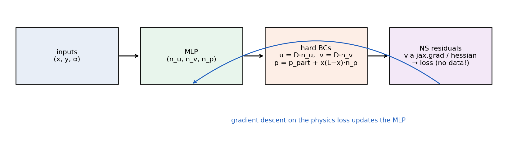
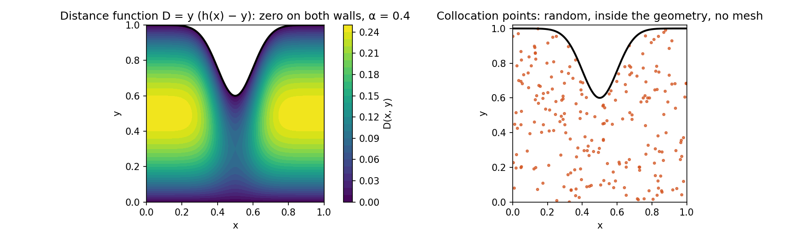
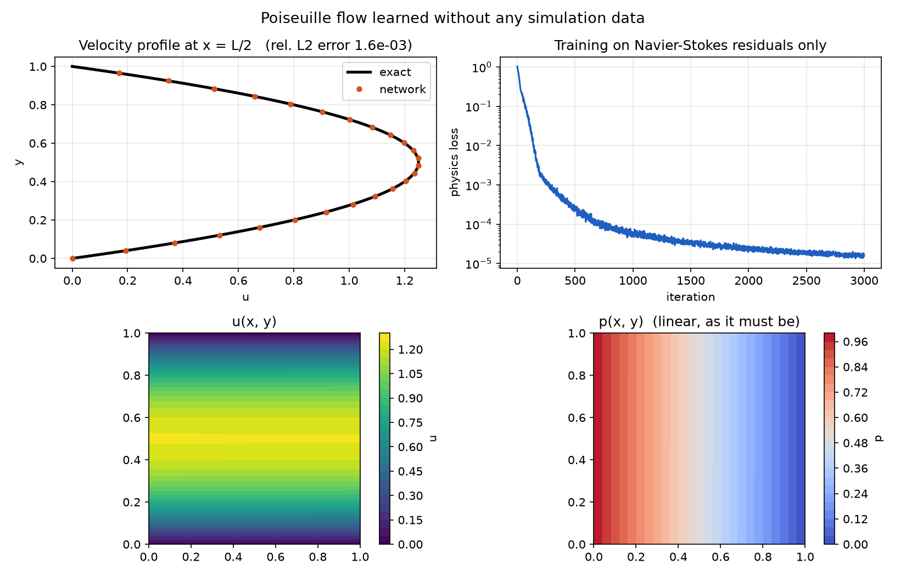
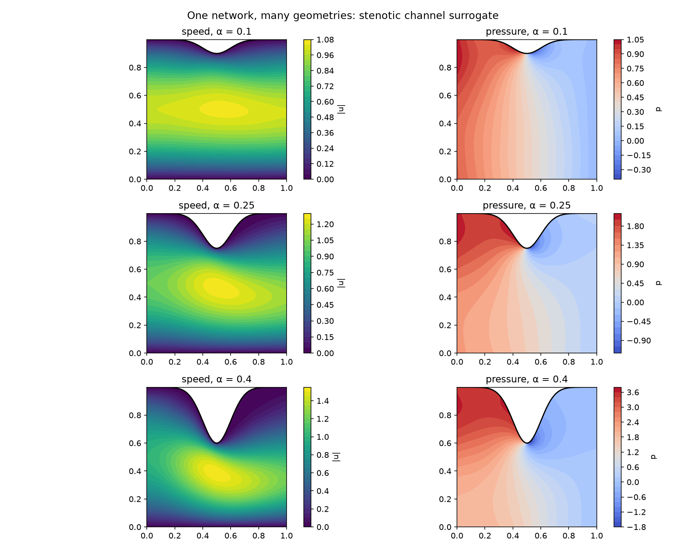
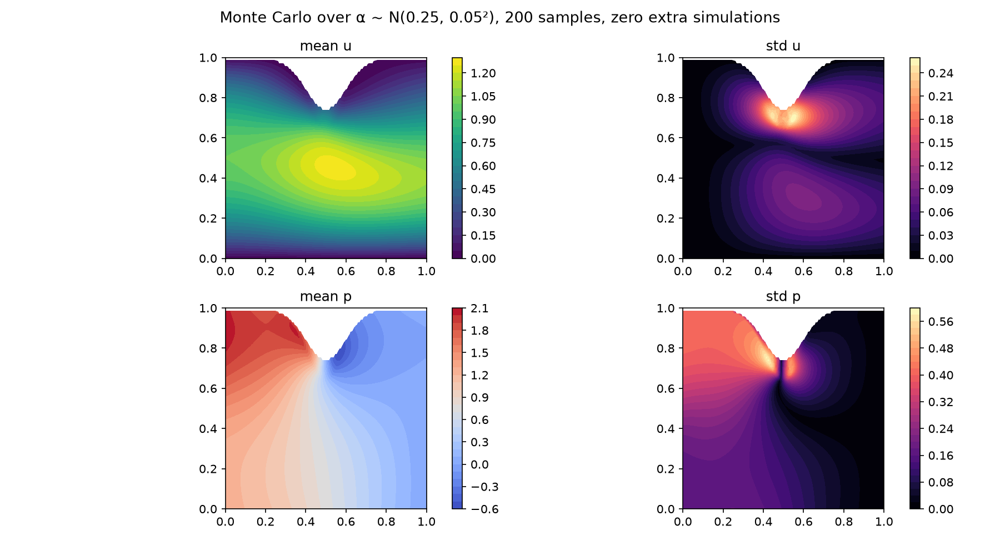

# Physics-Constrained Deep Learning for Fluid Flows (JAX)

A clean JAX implementation of **surrogate modeling for fluid flows without
simulation data**, after Sun, Gao, Pan & Wang (CMAME 2020). A neural
network is trained to satisfy the steady incompressible Navier-Stokes
equations at random points, with boundary conditions built into the
network **exactly** rather than penalized — so the only training signal is
physics. One file of library code, three runnable examples, one
dependency (`jax`) beyond NumPy and matplotlib.

<p align="center">

</p>

## Run it

```bash
pip install -r requirements.txt      # jax, numpy, matplotlib (CPU is fine)

python check_physics.py              # 1. verify the physics code (seconds)
python poiseuille.py                 # 2. flat channel vs. exact solution (~2 min)
python stenosis.py                   # 3. parametric stenotic channel (~5-10 min)
python uncertainty.py                # 4. Monte Carlo UQ with the model from step 3
```

> [!IMPORTANT]
> Run `check_physics.py` first. It pushes the **exact** Poiseuille solution
> through the same residual code the training uses and checks that all three
> Navier-Stokes residuals vanish — and that a deliberately wrong profile is
> rejected. If it prints `PASS` twice, the automatic-differentiation layer
> is correct and everything else is just optimization.

> [!TIP]
> Everything runs on CPU. A GPU build of JAX makes the stenosis example
> several times faster but is not required. Iteration counts are command-line
> options (`--iters`), so you can do a quick smoke test with `--iters 500`.

## The idea

Standard physics-informed networks add boundary-condition penalties to the
loss and hope the optimizer balances them. The paper's approach removes the
problem instead: write each field as a **particular solution** that already
satisfies the Dirichlet conditions, plus a **distance function** that is
zero on the boundary, times the network output:

```math
u = D(x,y)\,n_u, \qquad v = D(x,y)\,n_v, \qquad p = p_{part}(x) + x(L-x)\,n_p
```

With $D = y\,(h(x) - y)$ the no-slip condition holds on both walls for
*any* network weights, and with $p_{part} = \Delta p\,(1 - x/L)$ the inlet
and outlet pressures are exact. There is nothing left to enforce, so the
loss is just the momentum and continuity residuals at random collocation
points:

```math
\rho\,(u u_x + v u_y) + p_x - \mu\,(u_{xx} + u_{yy}) = 0, \qquad
\rho\,(u v_x + v v_y) + p_y - \mu\,(v_{xx} + v_{yy}) = 0, \qquad
u_x + v_y = 0
```

<p align="center">

</p>

> [!NOTE]
> **How the derivatives are taken matters in JAX.** Each residual is
> computed for a *single* point with `jax.grad` and `jax.hessian` of scalar
> functions, then vectorized over the batch with `jax.vmap`. Taking
> `jacfwd` of a batched function instead returns cross-sample Jacobians,
> which silently gives wrong derivatives for every point but the first
> (and costs O(N²) memory). `check_physics.py` exists to catch exactly
> this class of mistake.

## Examples

### 1. Poiseuille flow — validation against the exact solution

Pressure-driven flow between two plates. The exact solution is the
parabola $u = \frac{\Delta p}{2\mu L}\,y(H-y)$, $v = 0$, $p$ linear. The
script trains on physics alone, then reports the relative $L_2$ error of
the velocity profile against the parabola and plots the fields.

<p align="center">

</p>

### 2. Stenotic channel — one network, many geometries

The constriction severity $\alpha$ in the upper wall
$h(x) = H - \alpha\,e^{-50(x-0.5)^2}$ is an **input** to the network, so a
single training run produces a surrogate over the whole range
$\alpha \in [0.2, 0.6]$. The script plots speed and pressure for several
$\alpha$ values from the same trained model.

<p align="center">

</p>

### 3. Uncertainty quantification — free, once you have a surrogate

Because $\alpha$ is an input, propagating a distribution of $\alpha$ costs
one forward pass per sample. `uncertainty.py` draws
$\alpha \sim \mathcal N(\text{mean}, \text{std}^2)$, evaluates the surrogate
for each, and plots the mean and standard deviation of $u$ and $p$ — no
re-training, no simulations.

<p align="center">

</p>

> [!WARNING]
> The three result figures above are produced by running the scripts; they
> are committed to the repository after a run, so they show what the code
> in that commit actually produced. Re-run and re-commit them if you
> change the model or the training settings.

## Files

```
pcnn.py             library: MLP, problems with hard BCs, residuals, training
check_physics.py    residual-code verification with the exact Poiseuille solution
poiseuille.py       example 1
stenosis.py         example 2 (parametric geometry)
uncertainty.py      example 3 (Monte Carlo over alpha; needs models/stenosis.pkl)
figures/            images
```

### Adding your own geometry

Subclass `Problem` in `pcnn.py`: give it `n_inputs`, a `sample(n, rng)`
that returns collocation points inside the domain, and a
`fields(params, xi)` that composes the network output with your distance
function and particular solution. The residual and training code is
geometry-agnostic.

> [!CAUTION]
> Hard boundary conditions only cover **Dirichlet** conditions on
> boundaries where you can write a distance function. Traction or
> outflow conditions, and domains without a simple wall description,
> need penalty terms or a different construction — see the paper's
> discussion of general geometries.

## Reference

Sun, L., Gao, H., Pan, S., & Wang, J.-X. (2020). Surrogate modeling for
fluid flows based on physics-constrained deep learning without simulation
data. *Computer Methods in Applied Mechanics and Engineering*, 361, 112732.

```
@article{sun2020surrogate,
  title   = {Surrogate modeling for fluid flows based on physics-constrained deep learning without simulation data},
  author  = {Sun, Luning and Gao, Han and Pan, Shaowu and Wang, Jian-Xun},
  journal = {Computer Methods in Applied Mechanics and Engineering},
  volume  = {361},
  pages   = {112732},
  year    = {2020}
}
```

## Author

**Aiden Azarnoush**

## License

MIT — see [LICENSE](LICENSE).
